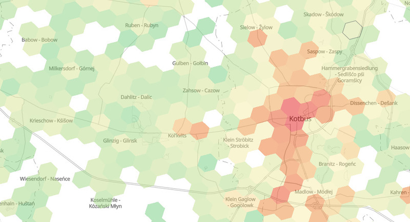
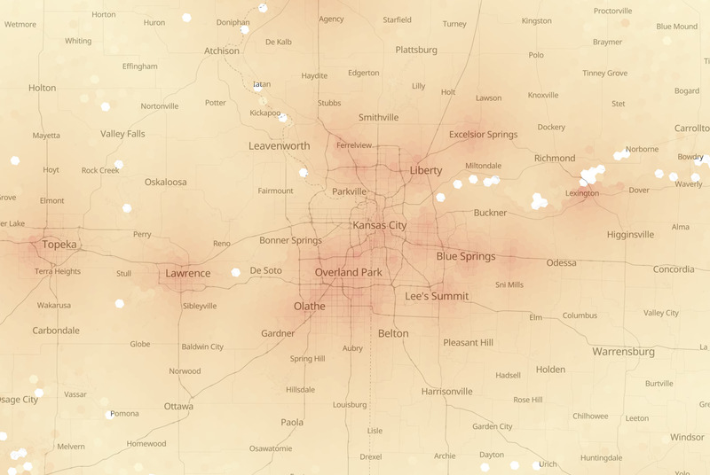
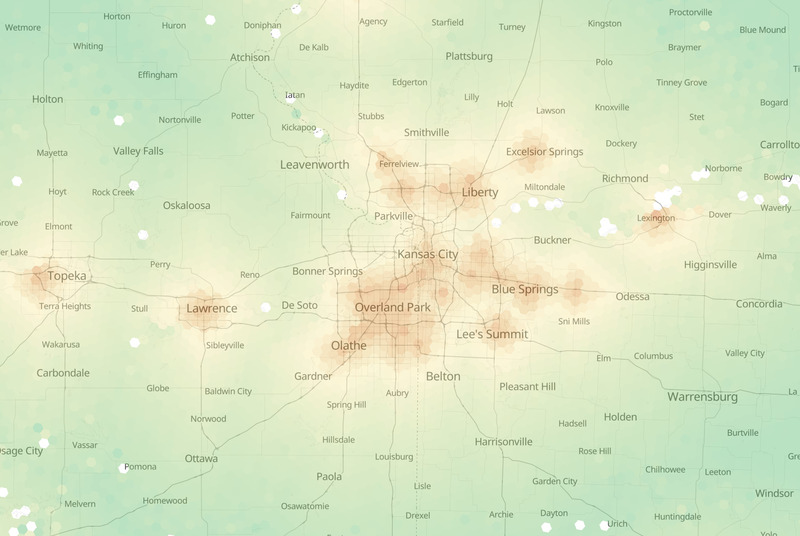
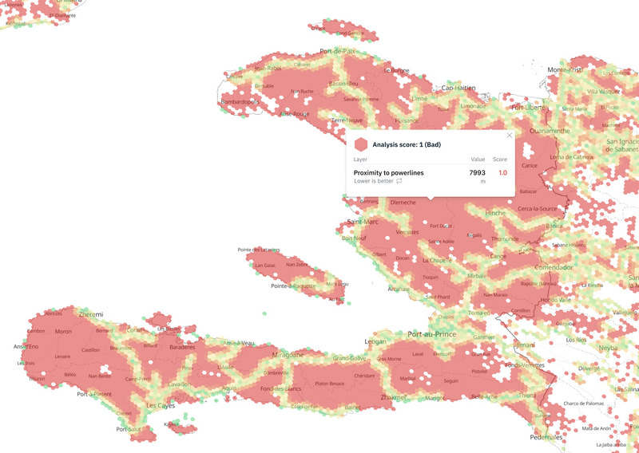
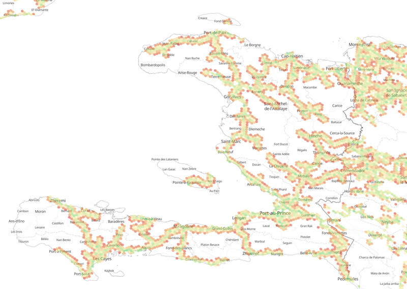
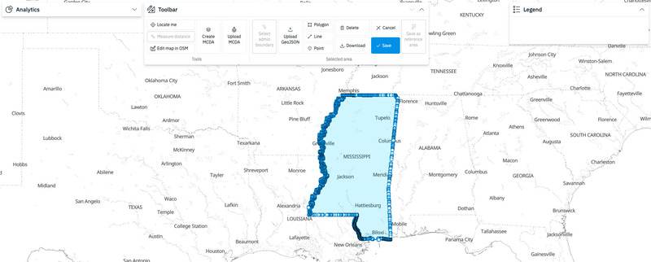
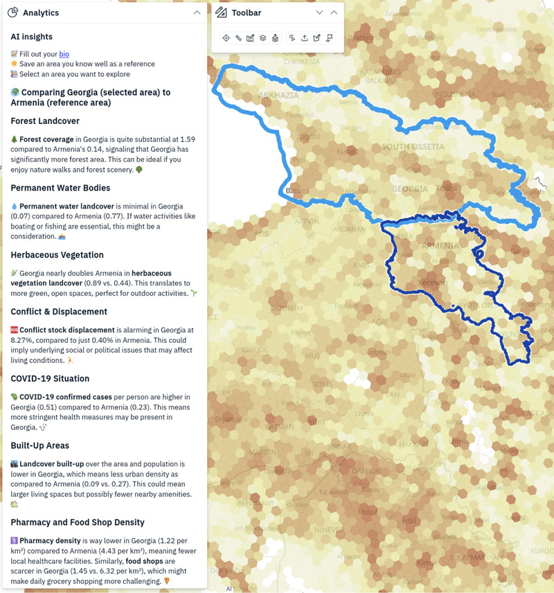

# User Guide

[Multi-Criteria Decision Analysis](#multi-criteria-decision-analysis)

[Area selection](#area-selection)

[AI insights](#ai-insights)

## Multi-Criteria Decision Analysis

<iframe width="800" height="470" src="https://www.youtube.com/embed/g7WMD10DMPs?si=Gl6RdNM0L3ufi0uF" title="YouTube video player" frameborder="0" allow="accelerometer; autoplay; clipboard-write; encrypted-media; gyroscope; picture-in-picture; web-share" referrerpolicy="strict-origin-when-cross-origin" allowfullscreen></iframe>

### Analysis creation

MCDA allows users to combine multiple layers on the map.  
Before combining layers, the following steps are applied to each layer:

* Determine global minimum and maximum values.  
* Select the best dataset transformations for optimal layer visualization.  
* Normalize values, with the minimum set to 0 and the maximum to 1\.

The results are visualized on the map, where hexagons with the lowest values (0) are shown in red, and those with the highest values (1) are shown in green.

### Analysis customization options 

Users can adjust each layer’s options, such as:

* Setting a custom value range.  
* Setting range outliers behavior.  
* Updating the values considered the worst and best for the analysis.

#### Value range

**Purpose:**

This is useful when the area of interest has values that deviate significantly from the global averages, or when you need to focus on a specific value range.  
For example, if you want to find areas far from electric vehicle stations, but the global maximum distance is around 7,000 km, it makes sense to set the maximum to a more realistic 70 km for this case.  

#### Outliers

Changes hexes score behavior with layer values out of considerable range.  
Possible values: 

- Clamp  
- Don’t modify  
- Hide

**Purpose:**

For example, consider the distance to power lines in Haiti from OSM data, with the upper limit set at 3000 meters, and the sentiment set that 0 is good and the longer distance is worse.

**Outliers: Clamp**  

**Meaning:** Values that exceed the limits contribute equally to the analysis, no matter how far they are from those limits.  
**Use Case:** Useful for identifying people living more than 3,000 meters from power lines, without needing to account for the exact distance.

**Outliers: Don’t modify**

**Meaning:** Contribution to the analysis increases with the distance from the acceptable limit.  
**Use Case:** Useful when analyzing locations for building a solar station, where distances beyond the limits are still considered but involve additional costs.

**Outliers: Hide**  

**Meaning:** Hexagons with values beyond the limits are excluded from the analysis.  
**Use Case:** Useful if non-electrified areas are not considered, for example, when opening a store.

#### Sentiments

Sentiments determine how the layer’s values impact the analysis:

* Bad → Good: Higher values are considered positive.  
* Good → Bad: Higher values are considered negative.

Purpose:  
This is useful when combining both negative and positive criteria, such as population density and the number of markets, to identify areas lacking food shops.

For example, you can set:

Food shops to Area (n/km²) bad (0) → good (21), n/km²  
Population (ppl/km²) (ppl/km²) good (0) → bad (4242), ppl/km²

In this case, red hexagons will highlight areas with high population density and low food shop availability.

#### Weight

By default, all layers contribute equally to the analysis using a weighted average. You can increase the weight of a specific layer (e.g., 2x, 3x) to give it more importance in the analysis.  
Also you can set 0 to prevent layer values influence to analysis final score. If you adjust layer range and set outliers hide for excluding some areas from your analysis, but you don’t need to consider these layer values in the analysis.   

#### Transform

Apply mathematical transformations to the values before normalization. These transformations help create a more linear distribution, providing clearer and more detailed insights for analysis.  
Possible values: 

- No transformation  
- Square root: sign(x)⋅√|x|  
- Cube root: ∛x  
- log₁₀(x \- xmin \+ 1\)  
- log₁₀(x \- xmin \+ ε)

**What is it for:**

Population distribution shows many areas with low population and a sharp rise in cities.   

Low-contrast visualizations like this one lose a lot of information and nuance. To recover this information and make the map more contrastive, GIS specialists employ mathematical transformations that make the distribution more linear-like. Here’s an example where we transform the distribution with Log(x):  

This map presents much more information, making mountains, small towns, and city outskirts distinguishable. Each layer has its own transformation function determined by the nature of the distribution. Previously, users had to do this manually for each layer. Now, Atlas automatically chooses the best transformation, making it easier to get a great analysis.

#### Normalize

All layers (criteria) can be rescaled to have a range in \[0, 1\], also known as rescale or min-max normalization. In case you want to get original values, set "no" value here.

## Area selection

<iframe width="800" height="470" src="https://www.youtube.com/embed/aCXaAYEW0oM?si=AXz-UM_-W6d-Zudw" title="YouTube video player" frameborder="0" allow="accelerometer; autoplay; clipboard-write; encrypted-media; gyroscope; picture-in-picture; web-share" referrerpolicy="strict-origin-when-cross-origin" allowfullscreen></iframe>

User can select area of interest on map using following tools on toolbar: 

### Select admin boundaries 

In “select admin boundaries” mode user can select administrative boundaries from dropdown after clicking to map hexagon.

### Upload GeoJSON

User can upload custom geometry from a computer using the Upload GeoJson tool. 

### Draw or edit geometry 

Create geometry  
Also user can create geometry using “Draw or edit geometry”.   
User can: 

* create on map   
  * Polygon  
  * Line   
  * Point   
* Edit selected area   

## AI insights

<iframe width="800" height="470" src="https://www.youtube.com/embed/aCXaAYEW0oM?si=Rr3deVxmSagXtnPz" title="YouTube video player" frameborder="0" allow="accelerometer; autoplay; clipboard-write; encrypted-media; gyroscope; picture-in-picture; web-share" referrerpolicy="strict-origin-when-cross-origin" allowfullscreen></iframe>

### Selected area analysis

This widget gives user statistical highlights on selected area in text format. 

This widget provides users with statistical highlights of a selected area in text format.

* Gathers data on the selected area.  
* Extracts values that significantly differ between the selected area’s averages and global averages.  
* Provides conclusions generated by a Large Language Model (currently ChatGPT) based on this data, presented in several paragraphs.

### Comparing analytics with reference area

By default, AI insights are generated by comparing area statistics to the world global values. The widget is capable of comparing different selected areas as well. To compare the area of interest to the area you're familiar with, select the latter and click "Save as reference area". 

Then select another area, and you'll get the AI report highlighting the differences or similarities with your reference area. Reference area can be removed in Profile.

### Personalizing the report

AI insights report is customizable. Provide a short bio: preferences for analytics, occupation, and interest in geospatial analysis, and LLM will personalize the response based on this info. Selected language is also taken into account while generating the report.
